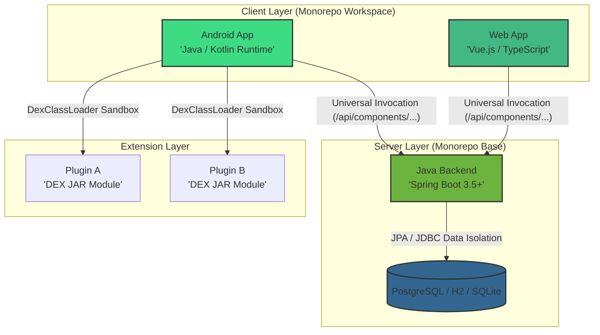

# Reveila-Suite

Reveila-Suite is a cross-platform, multi-tenant **Agentic AI Execution Fabric** designed to autonomously discover, orchestrate, and execute complex business logic at scale. Built on a foundation of **Clean Hexagonal Architecture** and a framework-agnostic core runtime engine, it provides secure, observable, and platform-independent environments for deploying autonomous AI agents that seamlessly interface with core transactional enterprise backbones, edge nodes, and legacy distributed architectures.

---

## 🏛️ The "Sovereign Mode" Experience

### Your AI Doesn’t Need a Passport. Or a Signal.
Introducing **Reveila Sovereign Mode**—the high-performance enterprise AI agent fabric engineered to execute 100% locally on sovereign edge devices. No forced cloud data pipelines. No network-induced latency bottlenecks. Total operational sovereignty.

### ✈️ The "Flight Mode" Paradox Solved
Most modern AI tools turn into high-latency dependencies or expensive paperweights the moment they lose connection. While other legacy applications stall waiting for slow cloud pipes to register a single command, Reveila is actively processing logic at the edge.

* **Offline System Reasoning:** Executes enterprise workloads natively utilizing high-speed local inference adapters directly on your flagship devices.
* **Zero-Latency Storage Grains:** Instant workspace data streaming and context matching via local vector stores without microsecond structural network lag.
* **The Sovereign Vault:** Total data boundaries. Your proprietary parameters, transaction histories, and workspace contexts remain exclusively inside your isolated local hardware layer.

---

## 🛡️ Trust-Boundaries Matrix

| Security Parameter | The Standard Cloud Way | The Reveila Sovereign Way |
| :--- | :--- | :--- |
| **Data Privacy** | Intercepted, aggregated, and utilized for central foundational training pipelines. | **Strict Sovereignty.** Fully localized context processing. Explicit user boundaries. |
| **Inference Speed** | 500ms–2000ms distributed remote network round-trip overhead. | **Instantaneous Execution.** 5ms–20ms isolated native response windows. |
| **Operational Continuity** | Remote infrastructure outages dictate operational downtime. | **Always On.** Native local execution during deep field transit or secure off-grid loops. |
| **System Authorization** | Software-only toggles vulnerable to remote boundary bypass. | **Hardware Gated.** Biometric-authenticated loops dictate physical verification. |

---

## 🗺️ System Topology & Interaction Flow




---

## 🏗️ Architectural Core

The system is anchored by **Reveila-Core**, a platform-agnostic engine that resides within the Backend and Android modules via shared library linkage.

* **Hexagonal Pattern Isolation:** Business logic is rigidly isolated in the Domain layer, while infrastructure adapters (Spring Boot components, Android framework configurations, Standalone drivers) are cleanly injected via the `PlatformAdapter` interface boundaries.
* **Universal Invocation Model:** Clients interact with systems components via a dynamic proxy mechanism using a centralized invocation endpoint: `/api/components/{componentName}/invoke`. This choice allows the frontend applications to call backend services dynamically without needing unique controller mappings for every new business method.
* **Dynamic Settings & Hot Reloading:** System properties are updated at runtime via a unified configuration layout. Modifications are persisted straight into `reveila.properties` and hot-reloaded into the `PlatformAdapter` context without requiring application or JVM reboots.
* **Dynamic Component Loading:** On startup, components are discovered, ordered by explicit priority metrics, and validated via JSON metadata containers using an internal `ConfigurationLinter` step to prevent host contamination.

---

## 📦 Project Directory Structure (Monorepo Layout)

The codebase leverages a clean monorepo setup to guarantee shared api structures and internal utility logic stay synchronized across development spaces:

| Module Base | Domain & Functional Responsibilities |
| --- | --- |
| **`/reveila`** | **Core Logic.** Framework-neutral Java primitives, shared domain data types, system utilities, and the core engine. |
| **`/spring`** | **Backend System.** Spring Boot 3.5+ application container wrappers providing JPA enterprise engines, routing security, and database persistence layers. |
| **`/android`** | **Mobile Infrastructure.** Android-specific adapters, system storage bindings, and encapsulated `DexClassLoader` plugin boundaries. |
| **`/apps`** | **Client User Interface.** Cross-platform customer workspaces utilizing unified React Native (Expo) and Compose Multiplatform code paths. |
| **`/interfaces`** | **External Bridges.** Framework-neutral system SDKs, shared model context descriptors, and target tracking tools (e.g., the security-focused CISO Dashboard). |
| **`/web`** | **Administrative Workspaces.** Vue.js based administrative controls and interface systems. |

---

## 🛠️ Technological Inventory

* **Core Systems Ecosystem:** Java 21, Kotlin, Spring Boot 3.5.x, Gradle (Kotlin DSL), Hibernate/JPA.
* **Edge & Client Engines:** React Native (Expo Environment with customized native Gradle wrappers), SQLite (with specialized native extensions), Node.js.
* **Enterprise Storage Fabrics:** PostgreSQL (with isolated schema/catalog tenancies), MongoDB, H2 (Local Profiles).

---

## 🧠 AI Architecture: The Agentic Core Runtime

### 🔄 The "AI Loop" Session Management

Agent activities are grouped into isolated, stateful sessions. These sessions are fully persisted, allowing reasoning states to be suspended, terminated, or resumed at a later timestamp. During an active execution thread, the **Agentic Loop** runs via the following deterministic pattern:

```
[System Instruction + Tool Definitions + User Intent] 
                        │
                        ▼
            [LLM Non-Deterministic Reasoning]
                        │
                        ▼
          [Structured JSON Tool Call Output]
                        │
                        ▼
        [Java Execution & Schema Validation (Host / OS)]
                        │
                        ▼
        [Tool Output Result Matrix Recovers] ─── (Loops back to stabilize)

```

### 🌉 LangChain4j Translation & Structural Type Safety

The engine integrates `LangChain4j` to act as an infrastructure abstraction driver layer between core domain interfaces and external inference models (e.g., cloud endpoints like OpenAI/Gemini vs local targets like Ollama). It manages low-level API serialization, enforces structural Java object mappings from raw model outputs, and permits swapping providers by tweaking single application property definitions.

### ⛓️ The Message Chain Pattern

To preserve accurate reasoning histories across multi-turn execution loops, the system maintains a chronologically ordered state array (`dev.langchain4j.memory.ChatMemory`). The `processLoop()` method in `AgenticFabric.java` explicitly pieces this array together on every turn, injecting four critical discrete roles:

1. **SystemMessage:** Contains core operational instructions, perimeter rules, and tools structured via the Model Context Protocol (MCP).
2. **UserMessage:** The raw incoming intent statement provided by the user.
3. **AiMessage:** Captures the LLM's explicit reasoning steps and generated tool-call parameters.
4. **ToolExecutionResultMessage:** Binds the execution result payload (e.g., PowerShell runtime output or REST data logs) back into the conversation context block.

---

## 📊 Prompt Standardization & Structural Security

### Markdown + XML Prompts

All system instructions and user payloads are assembled utilizing structural **Markdown + XML** markup configurations managed through `Prompt.getBasePrompt()`.

* **Markdown:** Provides macro-level system hierarchies, operational roles, and clear readability sections (`# ROLE`, `# CONTEXT`).
* **XML Tags:** Act as structural "firewalls" surrounding dynamic external data blocks (e.g., `<context_boundary>`), effectively stopping prompt injection attempts from altering target instructions.

### Format Performance Evaluation

| Architectural Strategy | Core Reasoning Capabilities | Token Asset Footprint | Injection Safety Profiles | Human Auditability |
| --- | --- | --- | --- | --- |
| **Plain Text** | Basic Pattern Discovery | Lowest Footprint | Poor Context Isolation | High Clarity |
| **JSON Specifications** | Moderate Logic Parsing | High Token Overhead | Good Structure Parsing | Low Auditing Clarity |
| **Markdown + XML** | **Highest Capability (81.2%)** | **Optimized Efficiency** | **Excellent (Tag Firewalls)** | **High Structural Clarity** |

---

## 💾 Context Optimization & Memory Footprint Controls

### Sliding Memory Windows

To prevent memory inflation and escalating token processing latency during long-running tasks, the system implements a runtime truncation strategy. After an execution track passes 10–15 turns, the engine automatically commands a lightweight model tracking step to summarize preceding entries, capturing historical state indicators while freeing block overhead using a defined `MessageWindowChatMemory` configuration:

```java
// How Reveila-Suite maintains conversational state at runtime
ChatMemory chatMemory = MessageWindowChatMemory.withMaxMessages(20);
chatMemory.add(UserMessage.from("Yes, run the script."));

// Execution step matches tool tracking pipelines
String result = terminal.execute(script);
chatMemory.add(ToolExecutionResultMessage.from(toolId, result));

// Sequential forward invocations dynamically inherit the optimized context window
String finalAnswer = model.generate(chatMemory.messages()).content();

```

### Size-Aware Session Management

Total operational session storage limits are defined inside `reveila.properties` via the `ai.optimization.history` property key (e.g., `10MB`).

* `AgentSessionManager.estimateSessionSize()` calculates the explicit memory allocation of a target session by analyzing its active messages array and parameter payload maps.
* When saving a tracking state via `saveSession()`, the engine sweeps the global workspace footprint; if the aggregated storage crosses your configured threshold boundary, an eviction step discards the oldest **Least Recently Used (LRU)** sessions to preserve memory safety.

---

## 🚀 Execution Configurations: Personal vs. Enterprise

### 1. The Autonomous Agent (Personal Edition Standalone)

Reveila Personal Edition allows the platform to run recurring tasks independently when authorized by the user.

* **Task Ingestion:** Bounded task scripts are defined using structured JSON schemas inside the `system-home/standard/tasks` workspace directory (see example configurations like `daily-news.json`).
* **Autonomous Worker Thread:** The `AutonomousAgent` tracking class invokes a `doTask()` sweep pattern on a 30-second loop interval (governed through `standard.json`). It automatically loads task definitions, spins up an isolated `AgentSession`, and triggers execution loops via the core `AgenticFabric`.
* **Dynamic Script Execution:** If the agent calculates that a problem requires a custom operational script, it can dynamically assemble and run scripts natively through `ReveilaTerminal.executeDynamicScript()` using a biometrically validated authorization gate.

```
[User Intent Provided] ──> [LLM Realizes Tool Gap] ──> [LLM Synthesizes Script (PS1 / Bash)] 
                                                                    │
                                                                    ▼
[LLM Summary Outputs Completed] <── [Result Matrix Captured] <── [Reveila Runs Script via HITL Gate]

```

### 2. Pre-Defined Secure Tools (Enterprise Edition Fabric)

To guarantee security across absolute corporate tiers, Reveila Enterprise Edition restricts execution parameters strictly to an authenticated list of predefined tools managed through `ReveilaTerminal.executeSafeScript()`.

* **Platform Sandbox Engineering:** Enterprise operations run under low-privilege service configurations, hard-capping execution timeouts at 30 seconds to block infinite loops or runaway threads.
* **Enterprise Tool Portfolio:**
* *Terminal Core Interface:* Implemented via stable `Xterm.js` and `node-pty` foundations.
* *Agentic Automation Layers:* Driven through structured browser engines using `Playwright` integration blocks.
* *Sandboxed Compute Execution:* Leverages isolated WebAssembly runtimes (`Wasmtime`) for near-native speed with complete memory encapsulation.
* *Localized Architecture Storage:* Managed via lightweight embedded analytical architectures (`DuckDB` / `ChromaDB`).


---

## ⚡ High-Precision Context Pipelines (Tool RAG & Knowledge Vault)

* **Two-Stage Tool RAG:** To prevent context bloating and eliminate model logic degradation ("Short Model Tax"), `DynamicToolProvider.java` runs a two-stage tool injection pipeline. It performs an initial semantic vector search across available system actions, then sorts candidates through a dedicated `ScoringModel` step to pass only high-relevance tool parameters into the operational prompt window.
* **Knowledge Vault Injections:** For every incoming user intent, `AgenticFabric.java` triggers an internal document lookup. Relevant internal repository blocks (extracted from user guides, PDFs, or system specifications) are automatically parsed and wrapped safely inside the `<context_boundary>` block of the instruction matrix.

---

## 🔌 API Invocation Contracts

To trigger model tracking processes via remote REST configurations, target payloads are dispatched to the core `AgenticFabric.processIntent()` service engine, which returns unified JSON payload metadata schemas tracking execution status:

```json
{
  "status": "completed",
  "reasoning": "Determined system log inflation stems from unarchived output logs. Prepared file compression routines.",
  "result": "Dispatched compression execution task across target directories successfully.",
  "confidence-score": 1.0,
  "tool-call": []
}

```

---

## 👨‍💻 Platform Author & Principle Executive Advisory

**Charles Lee**
*Senior Technology Executive, Enterprise Systems Architect, and Fractional CTO.*

Specializing in macro-level corporate application modernization, complex systems integration engineering, strategic AI adoption roadmaps, and high-concurrency software frameworks within heavily regulated industries (including Financial Services, Healthcare, Transportation, and Energy ecosystems). Deep operational background managing large-scale, multi-million dollar technology portfolios, executing technical due diligence pipelines across critical M&A lifecycle windows, and translating highly complex distributed systems architectures into explicit, strategic milestones for enterprise organizations.

> *"Inspired by the raw operational flexibility of standard automation tools. Hardened by the rigid security standards of modern compliance frameworks. Engineered explicitly for sovereign technology control."*
