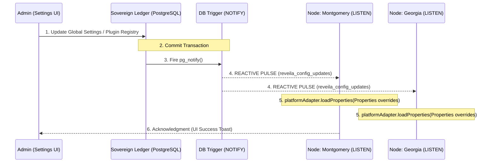

This diagram visualizes the real-time synchronization between the centralized control plane and the decentralized agentic fabric.

**Verdict:** Your understanding of the flow is spot on. This architecture ensures that even a 1,000-node cluster stays synchronized with sub-second latency the moment you click "Save" in the dashboard.