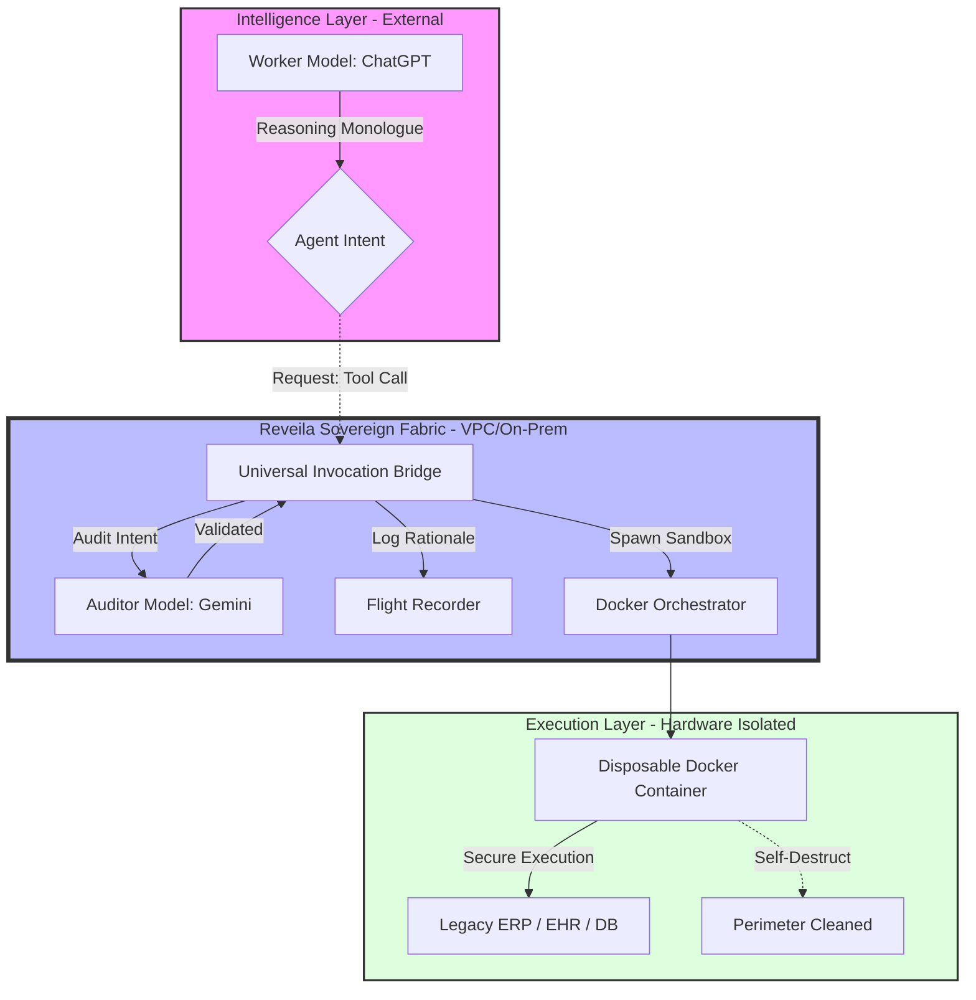

# Physical Isolation Diagram

```mermaid
graph TD
    subgraph AI_Cloud [Intelligence Layer - External]
        A[Worker Model: ChatGPT] -- Reasoning Monologue --> B{Agent Intent}
    end

    subgraph REVEILA_FABRIC [Reveila Sovereign Fabric - VPC/On-Prem]
        direction TB
        C[Universal Invocation Bridge]
        D[Auditor Model: Gemini]
        E[Flight Recorder]
        F[Docker Orchestrator]
        
        B -. "Request: Tool Call" .-> C
        C -- "Audit Intent" --> D
        D -- "Validated" --> C
        C -- "Log Rationale" --> E
        C -- "Spawn Sandbox" --> F
    end

    subgraph ISOLATED_RUNTIME [Execution Layer - Hardware Isolated]
        G[Disposable Docker Container]
        H[Legacy ERP / EHR / DB]
        
        F --> G
        G -- "Secure Execution" --> H
        G -. "Self-Destruct" .-> I[Perimeter Cleaned]
    end

    %% Highlighting the separation
    style AI_Cloud fill:#f9f,stroke:#333,stroke-width:2px
    style REVEILA_FABRIC fill:#bbf,stroke:#333,stroke-width:4px
    style ISOLATED_RUNTIME fill:#dfd,stroke:#333,stroke-width:2px
```
