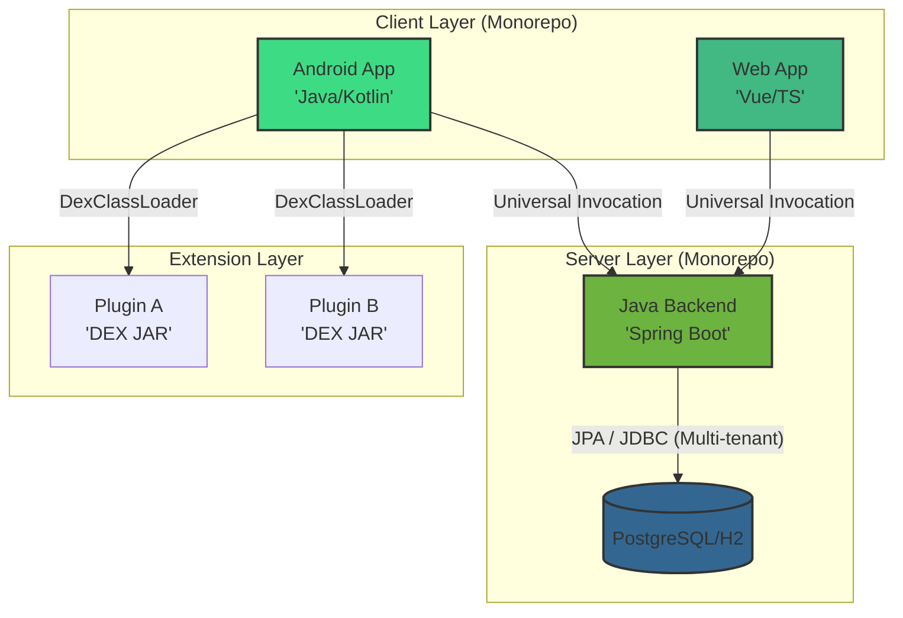

# 🧠 Memory Bank: System Map
**Status:** Active | **Architecture:** Hexagonal / Monorepo

## 🗺️ System Topology (Mermaid)

## 🏗️ Architectural Core
The system is anchored by **Reveila-Core**, a platform-agnostic engine that resides within the Backend and Android modules via shared library linkage.

- **Hexagonal Pattern:** Business logic is isolated in the Domain layer, while infrastructure (Spring Boot, Android, Standalone) is injected via the `PlatformAdapter` interface.
- **Universal Invocation Model:** Clients interact with components through a proxy mechanism rather than hardcoded endpoints. This ensures the Core logic is exposed consistently across all platforms.
- **Dynamic Component Loading:** Components are discovered, sequenced by priority, and validated via JSON metadata and the system's internal `ConfigurationLinter` at startup.

## 📦 Project Structure (Monorepo)
The suite is organized into specialized modules to maintain strict separation of concerns:

| Module | Description |
| :--- | :--- |
| `/reveila` | **Core Logic.** Shared Java classes, utilities, and the platform-agnostic system engine. |
| `/spring` | **Backend.** Spring Boot 3.5+ implementation providing JPA persistence and Security. |
| `/android` | **Mobile Infrastructure.** Android-specific adapters and DEX loading logic. |
| `/web` | **Web Frontend.** Vue.js based administrative and user interfaces. |
| `/interfaces` | **External Bridges.** Official home for the Universal SDK, framework-agnostic bridges, and specialized oversight UIs (like the CISO Dashboard). |

## 🔌 Communication & Invocation Path

### 1. Web/Mobile to Backend
Utilizes the **Universal Invocation Endpoint**: `/api/components/{componentName}/invoke`. 
This architectural choice allows the frontend to call backend services dynamically without needing unique controller mappings for every new business method.

### 2. Android to Plugins
Leverages a **DEX Loading Strategy** via `DexClassLoader`. 
This allows the mobile client to extend its functionality at runtime by loading external JARs, which are "shadowed" to prevent classpath conflicts with the host application.

## 🚦 System Boundaries

- **Boundary A (Web/Mobile -> Spring):** Handled via REST/JSON. Protected by CORS and Spring Security.
- **Boundary B (Spring -> Core):** Handled via the `PlatformAdapter` interface. No network overhead; communication happens within the local JVM.
- **Boundary C (Android -> Core):** Handled via the Android Service bridge, supporting local-first execution of core logic.
